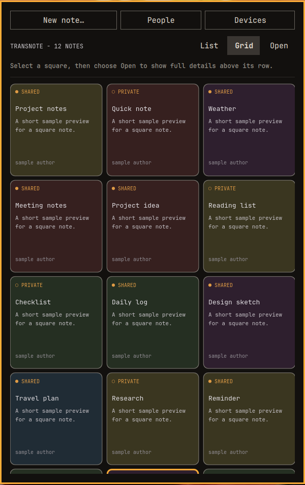

# TransNote

Fast shared notes for the Omarchy bar.



TransNote lets you write notes, share them between your machines or with trusted peers, add comments, and exchange attachments.

It supports three modes:

- **Local** — notes stay on this machine.
- **LAN / folder sync** — shared notes move through a folder synchronized by Syncthing, Dropbox, rsync, or another file-sync tool.
- **Internet sync** — shared notes and comments are sent through Nostr relays using end-to-end encryption.

Normal use and setup are available from the TransNote panel.

## Features

- Local text notes
- Share and unshare notes
- Peer comments
- LAN folder synchronization
- Encrypted Internet synchronization
- File attachments over folder sync
- SHA-256 verification of received attachments
- Image thumbnails and text previews
- Copy note content to the clipboard
- Fenced code blocks with per-block copy
- Keyboard navigation
- Per-note color tint
- New-note indicators
- Local backup of the previous note state

Notes are private by default. TransNote does not publish a note until you explicitly share it.

## Requirements

- Omarchy with Quickshell plugin support
- Bash and standard Linux command-line utilities
- `wl-copy` for clipboard operations
- `xdg-open` for opening received attachments

For **Internet sync**, TransNote also requires system Node.js.

Install it explicitly on Omarchy if it is not already available:

```bash
omarchy pkg add nodejs
```

TransNote does not install Node.js or npm packages at runtime. The reviewed Nostr helper dependencies are shipped inside the committed plugin bundle.

LAN folder synchronization does not require Node.js or Nostr.

Syncthing is recommended for LAN synchronization, but it is not required. Any tool that reliably synchronizes the selected folder can be used.

## Tested compatibility

The TransNote `0.5.6` release candidate has runtime acceptance evidence for this exact environment:

- TransNote runtime baseline: `184036235f064281533a631aa70c794e62ea96f4`
- Omarchy `4.0.4-1`
- Quickshell `0.3.1`
- `x86_64`
- Linux kernel `7.2.5-3-omarchy`
- Wayland
- Hyprland
- single display at `1920x1080`, scale `1.25`, `60 Hz`
- AMD Lucienne graphics

This is a tested compatibility scope. It is not a claim that other configurations are incompatible.

The `0.5.6` acceptance scope did not include X11, multi-monitor configurations, other architectures, or other display scaling values.

## Installation

Install and enable TransNote directly from GitHub:

```bash
omarchy plugin add https://github.com/ariDev1/transNote.git --enable
```

Then open TransNote from the Omarchy bar.

The plugin ID is:

```text
aridev1.transnote
```

## Quick setup

Open the **Setup** tab in TransNote.

### 1. Name this machine

Choose a stable device name such as:

```text
laptop
```

or:

```text
desktop
```

Keep this name stable after you start sharing notes.

### 2. Configure a shared folder

For LAN synchronization, select a folder such as:

```text
~/transnote-lan
```

TransNote can create the local folder for you.

The same folder must then be synchronized between your machines.

### 3. Configure trusted peers

Add the device names that are allowed to participate in your folder-sync setup.

Example:

```text
laptop,desktop
```

TransNote writes one snapshot per device into the shared folder.

Only notes marked as shared are included.

## LAN synchronization

LAN synchronization uses normal files. It does not require an Internet service.

A typical configuration is:

```text
Machine A
~/transnote-lan
      ⇅
   Syncthing
      ⇅
~/transnote-lan
Machine B
```

Each device writes its own snapshot:

```text
<deviceId>.json
```

For example:

```text
laptop.json
desktop.json
```

Peer snapshots are checked automatically.

You can also use **Check for peers now** in the Setup panel.

The Setup panel shows synchronization diagnostics when troubleshooting is necessary.

### Important privacy note

Folder-sync snapshots contain the notes that you explicitly share through that folder.

Anyone who has access to the synchronized folder can potentially read those shared files.

Use appropriate folder permissions and only synchronize the folder with machines and users you trust.

For sensitive remote sharing, use TransNote's encrypted Internet synchronization instead.

## Internet synchronization

Internet synchronization uses Nostr relays.

TransNote creates a private Nostr key on your machine and shows a public sharing code.

To connect with another TransNote user:

1. Copy your public code from the TransNote panel.
2. Send it to your friend through a trusted communication channel.
3. Ask them for their code.
4. Add their code under **Add a friend**.

Your private key stays on your machine.

The private key is stored at:

```text
~/.local/share/transnote/nostr_key
```

Never share this file.

Internet synchronization uses encrypted messages. Relay servers receive ciphertext rather than your note text.

TransNote will not publish Internet notes when no recipients are configured.

## Attachments

Attachments are supported through **folder synchronization**.

Attach a file to one of your own notes from the attachment row.

Maximum attachment size:

```text
25 MB
```

Attachment bytes are stored below:

```text
<syncDir>/.attachments/
```

The note itself contains attachment metadata including:

- file name
- file size
- SHA-256 hash

Received files are hashed locally before TransNote marks them as verified.

TransNote can:

- show image thumbnails
- preview text files
- save received files to `~/Downloads`
- open safe files with the system handler
- report missing or invalid attachment data

Saved files never overwrite an existing file. TransNote creates a new numbered file name instead.

Files that look executable, or files with the executable bit set, are not opened automatically. They remain save-only.

Attachment bytes are currently transported through folder sync. Internet-shared notes can carry attachment metadata, but not the attachment bytes.

## Comments

Shared notes can contain comments.

Comments follow the same synchronization path as the note:

- folder-synchronized notes exchange comments through peer snapshots
- Internet-shared notes exchange comments through encrypted Internet synchronization

Local comments are stored with the local note state.

## Delete, unshare, hide

Three different actions, three different scopes:

- **Delete** (trash icon, or `x` on a deletable note): deletes the note
  **everywhere** — your own notes plus your own Internet copies. A delete
  marker is published to folder peers and to the Internet relays (NIP-09),
  so the note stays deleted after updates, restarts and re-fetches.
- **Unshare** (share icon on a shared note): keeps the note locally but
  stops sharing it. Peers drop their copy the same way as for delete; if
  you share it again later, the live note wins and reappears for peers.
- **Hide** (eye-off icon, or `x` on someone else's note): dismisses a
  peer's note **on this machine only**. Nobody else is affected. Hidden
  notes are listed with an "Unhide all" button at the top of the Notes
  view.

Renaming the machine re-signs your local notes to the new name
automatically (the stale `<old-name>.json` snapshot is removed) — but
peers must allow-list the new name afterwards.

## Keyboard controls

TransNote supports keyboard-first operation.

| Key | Action |
|---|---|
| `j` / `k` | Move between notes |
| `↑` / `↓` | Move between notes |
| `Enter` | Expand selected note |
| `c` | Copy note content |
| `s` | Share or unshare |
| `x` | Delete deletable note (hide someone else's) |
| `a` | Open attachment controls |
| `t` | Change note tint |
| `/` | Focus note composer |
| `Ctrl+Enter` | Add note |
| `Esc` | Close or leave the current action |

When a text field has focus, normal typing is passed to that field.


## Optional Agent CLI

TransNote includes an optional local command-line interface for AI agents and other local automation.

The normal Omarchy plugin installation stays passive. The Agent CLI is not added to your PATH automatically.

Install it explicitly:

```bash
./tools/install-agent-cli.sh
```

This creates:

```text
~/.local/bin/transnote-agent
```

Remove only the CLI link with:

```bash
./tools/uninstall-agent-cli.sh
```

The installer and uninstaller use only the current user account. They do not change shell configuration or TransNote data.

### Commands

Check the running TransNote instance:

```bash
transnote-agent status
```

Inspect the machine-readable v1 command contract:

```bash
transnote-agent capabilities
```

List visible notes:

```bash
transnote-agent list
```

Read one visible note by ID:

```bash
transnote-agent get NOTE_ID
```

Search visible note titles and bodies:

```bash
transnote-agent search "measurement"
```

Create a local note:

```bash
transnote-agent create \
  --title "Test result" \
  --body "Measurement complete"
```

Add a comment to a visible note:

```bash
transnote-agent comment NOTE_ID \
  --text "Confirmed"
```

Share one note that was created through the Agent API:

```bash
transnote-agent share NOTE_ID
```

Agent responses use one JSON object per invocation.

The current protocol version is `1`. Each valid TransNote response includes:

```text
protocolVersion
```

Every CLI JSON result, including locally generated errors, includes `protocolVersion`.

The `capabilities` response describes non-empty argument requirements, the `create` rule that at least one of `title` or `body` must be non-empty, expected command errors, and the stable CLI error-to-exit-code mapping.

Exit codes are:

- `0` — command completed successfully
- `2` — invalid command or invalid argument
- `3` — TransNote runtime is unavailable or not ready
- `4` — requested object was not found or the requested operation is not allowed
- `5` — protocol or response error

Notes created through the CLI are private by default. Sharing is a separate, explicit share command.

The Agent API can share only a visible local note that was created through the Agent API. It cannot share a human-created local note, a LAN note, or a Nostr note. The normal human Share control remains unchanged and more powerful.

The core API enforces this technical capability boundary. An agent adapter must call `transnote-agent share` only when the user explicitly asked to share or publish the note.

Agent provenance is shown with a subtle `AI` marker for agent-created notes and comments. This provenance is local-only metadata and is not synchronized through LAN or Internet note payloads.

The CLI uses the existing local TransNote identity. It does not accept an author override.

The first Agent CLI intentionally does not expose:

- delete
- unshare
- hide
- LAN pairing
- synchronization administration
- attachment mutation
- arbitrary filesystem access
- arbitrary command forwarding

The Agent CLI is a restricted TransNote capability. It is not a sandbox.

An AI agent that already has full shell access can bypass this CLI and access other user-level resources directly. Give an agent the `transnote-agent` capability when you want a restricted TransNote interface. Do not treat the CLI as isolation from an unrestricted local shell.


### OpenCode adapter

TransNote includes an optional restricted OpenCode adapter under:

```text
tools/opencode/
```

The adapter exposes only these dedicated custom tools:

```text
transnote_status
transnote_list
transnote_search
transnote_create
transnote_comment
transnote_share
```

The OpenCode profile denies all other capabilities by default. It allows only the six named TransNote tools and the user-question tool. General shell access, filesystem tools, Git, web access, and subagents remain denied.

The custom tools call the fixed `~/.local/bin/transnote-agent` executable with an argument array. They do not use a shell. The adapter preflight checks this same fixed executable path.

`transnote_create` creates a private note. `transnote_share` accepts only one note ID. The adapter must use `transnote_share` only when the user explicitly asks to share or publish the note. The TransNote core still verifies that the target is a visible local Agent-created note.

Install the OpenCode adapter explicitly:

```bash
./tools/opencode/install.sh
```

The adapter supports the OpenCode V1 permission model. An unknown major version fails closed. A new or changed OpenCode version is not trusted until the permission-boundary acceptance test passes.

The non-mutating permission test is stored at:

```text
tools/opencode/security-test.txt
```

Run that test with the restricted TransNote agent. After it passes, record the exact tested OpenCode version:

```bash
./tools/opencode/mark-tested.sh --accept-security-test
```

Start the restricted agent only through:

```bash
./tools/opencode/run.sh
```

A separate state-transition field test for explicit Share intent is stored at:

```text
tools/opencode/share-test.txt
```

That test uses two separate user messages. The first message creates a private Agent note. The second message explicitly requests Share. This proves that creation and sharing remain separate state transitions.

Remove the adapter with:

```bash
./tools/opencode/uninstall.sh
```

## Data and privacy

TransNote stores its local data below:

```text
~/.local/share/transnote/
```

This includes:

```text
notes.json
notes.json.bak
friends.json
nostr_key
attachments/
```

TransNote restricts its private data directory and files to the local user.

The previous `notes.json` state is preserved as:

```text
notes.json.bak
```

This provides a simple recovery point for local notes.

### What leaves the machine

A local note does not leave the machine unless you explicitly share it.

When folder synchronization is active, shared note data is written to the configured sync folder.

When Internet synchronization is active, shared data is encrypted for configured recipients before it is sent to the configured Nostr relays.

## Updating

For a Git-managed installation:

```bash
omarchy plugin update aridev1.transnote
```

The current TransNote version is shown in the panel footer.

## Removal

Remove TransNote with:

```bash
omarchy plugin remove aridev1.transnote
```

Omarchy removes the installed plugin checkout.

TransNote user data under:

```text
~/.local/share/transnote/
```

and an external synchronization folder such as:

```text
~/transnote-lan
```

are separate from the plugin installation.

This prevents plugin removal from silently destroying user notes, keys, or synchronized files.

Delete those directories manually only when you intentionally want to remove their data.

## Troubleshooting

### Peer notes do not appear

First verify that the synchronization folder itself works independently of TransNote.

Create a temporary file on one machine:

```bash
touch ~/transnote-lan/transnote-sync-test
```

Confirm that the file arrives on the other machine.

If it does not, fix the folder synchronization system first.

Then check:

1. Both machines use different stable device names.
2. Each machine allows the other device name.
3. The note is marked as shared.
4. The peer snapshot exists in the synchronization folder.
5. Both machines run a compatible TransNote version.

The Setup panel also provides peer and synchronization diagnostics.

### Recover the previous local note state

TransNote keeps the previous state at:

```text
~/.local/share/transnote/notes.json.bak
```

To restore it:

```bash
cp ~/.local/share/transnote/notes.json.bak \
   ~/.local/share/transnote/notes.json
```

### Internet sync reports that Node.js is missing

Install the required system runtime:

```bash
omarchy pkg add nodejs
```

Internet sync stays disabled until `/usr/bin/node` is available. Local notes and LAN synchronization continue to work without Node.js.

Then restart or reopen TransNote.

## Project structure

```text
Panel.qml
Agent.js
Store.js
bin/transnote-agent
nostr/sync.mjs
nostr/sync.bundle.mjs
tools/build_nostr_bundle.sh
tools/install-agent-cli.sh
tools/uninstall-agent-cli.sh
manifest.json
package.json
package-lock.json
```

`Panel.qml`
: Omarchy / Quickshell user interface and runtime integration.

`Agent.js`
: Pure serialization and search helpers for the restricted Agent CLI interface.

`bin/transnote-agent`
: Local JSON command-line client for the restricted TransNote IPC target.

`Store.js`
: Note, comment, peer, attachment, and validation logic.

`nostr/sync.mjs`
: Maintainable source for the Internet synchronization and encryption bridge.

`nostr/sync.bundle.mjs`
: Reviewed runtime bundle used by the plugin.

`tools/build_nostr_bundle.sh`
: Development-only script that generates the committed runtime bundle.

`tools/install-agent-cli.sh`
: Optional user-level Agent CLI installer.

`tools/uninstall-agent-cli.sh`
: Optional user-level Agent CLI removal script.

`manifest.json`
: Omarchy plugin manifest.

`package.json`
: JavaScript dependency declaration.

`package-lock.json`
: Locked npm dependency versions and integrity hashes.

## Support and security

For normal bugs, compatibility reports, and support requests, use:

```text
https://github.com/ariDev1/transNote/issues
```

For security reports, follow [`SECURITY.md`](SECURITY.md). Do not publish sensitive vulnerability details in a public issue.

Third-party runtime dependency and bundled-license information is in [`THIRD_PARTY_NOTICES.md`](THIRD_PARTY_NOTICES.md).

Preview capture procedure and reference display conditions are in [`docs/preview-capture.md`](docs/preview-capture.md).

## License

TransNote is open-source software released under the **ISC License**.

See [`LICENSE`](LICENSE).

## Source

GitHub:

```text
https://github.com/ariDev1/transNote
```